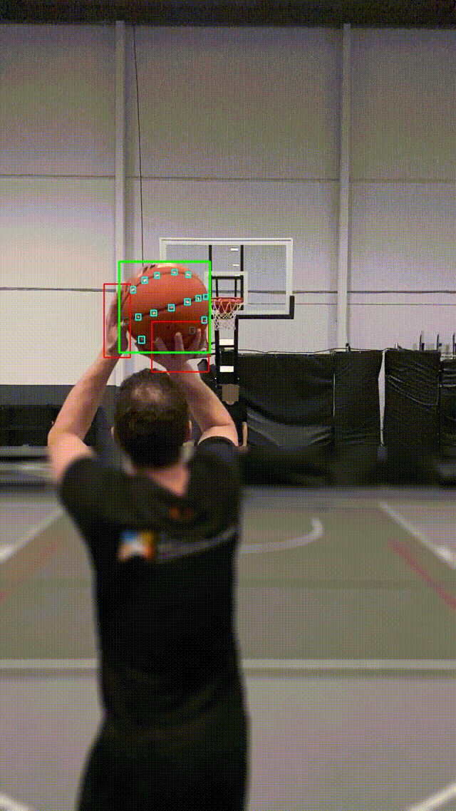
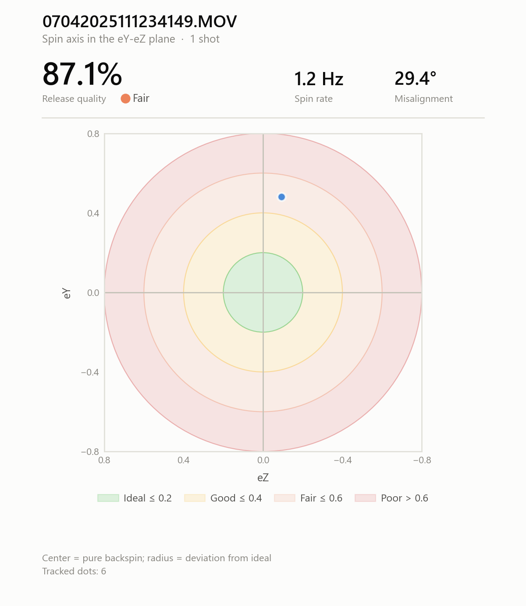

# SpinDoctor

**Automated basketball spin analysis from video.** SpinDoctor takes a shooting clip and measures how the ball rotates in flight — spin rate, 3D spin axis, and release quality — using a fine-tuned object-detection model and rigid-body motion tracking.



---

## What it measures

For each shot, SpinDoctor produces:

- **Spin rate** (Hz) — how many rotations per second the ball completes.
- **Spin axis** (eX, eY, eZ) — the 3D direction of rotation: clean backspin vs. a tilted axis.
- **Release quality** (0–100%) — how close the measured spin is to ideal backspin.
- **Release consistency** — shot-to-shot variability across multiple attempts.
- A **bullseye plot** visualizing axis alignment, and a **CSV** with every metric.



---

## How it works

A basketball in flight is a rotating sphere, and recovering its rotation axis from 2D video means tracking markers on that sphere and solving for the rotation that best explains their motion. SpinDoctor does this in five stages.

1. **Detection.** A fine-tuned RF-DETR model detects three classes in every frame — the ball, the markers (dots) on it, and the shooter's hands.
2. **Release detection.** The moment the ball separates from the hand is found automatically; measurement starts there, once the ball is in free flight.
3. **Dot tracking.** Because the markers are tiny, the ball region is cropped and magnified before detection to recover dots a full-frame pass would miss. Detected dots are projected onto a unit sphere.
4. **Rigid-body matching.** Dots are matched frame-to-frame with a rigid-body model (Kabsch alignment with an inertial prior and directional gating), recovering the incremental rotation between frames rather than tracking each dot in isolation.
5. **Spin recovery.** With correspondences established, recovering the axis becomes an instance of **Wahba's problem**, solved with Davenport's q-method: a 4x4 K matrix is built from the paired marker directions and its dominant eigenvector — the optimal quaternion — is extracted by power iteration. The rotation is measured between the *first* and *last* frame of the window rather than step by step, so the same measurement noise spans a larger angle and costs less in relative error. Results are rendered as the bullseye plot and written to CSV.


---

## Results


The detection model (see [Model](#model)) reaches the following on its held-out test set:

| Metric    | Value |
| --------- | ----- |
| mAP@50    | 75.6% |
| Precision | 85.4% |
| Recall    | 75.4% |
| F1        | 79.6% |

Detection is strongest on the ball and hands. The dot markers are the hardest class — only a few pixels wide after resizing — and are the main accuracy bottleneck (see [Limitations](#limitations)).

---

## Installation

Requires **Python 3.10+**.

```bash
git clone https://github.com/frandam94/SpinDoctor.git
cd SpinDoctor
python -m venv .venv
# Windows:   .venv\Scripts\activate
# Linux/Mac: source .venv/bin/activate
pip install -r requirements.txt
```

Model weights are **not** included (they are large and dataset-specific). Place a compatible RF-DETR checkpoint at `rf-detr/weights.pt`, or train your own (see [Training](#training-your-own-model)). Weights for the original model are available on request.

---

## Usage

Single shot:

```bash
python main.py --video "shot1.MOV" --output ./output
```

A folder of clips, or a folder organized per player:

```bash
python main.py --folder ./clips --output ./output
python main.py --player-folder ./gym_videos --output ./output
```

Each shot gets its own output folder containing a bullseye plot and frame-by-frame tracking images. Across the run, a `results.csv` collects one row per shot with columns `video, release_frame, ex, ey, ez, spin_rate_hz, misalignment, quadrant, rotation_deg`. Release quality and release consistency are computed for the bullseye plot and rendered on it, not written to the CSV.

In `--player-folder` mode each player also gets an aggregated bullseye and a `<player>_results.csv`, plus a global `all_players_results.csv` at the output root.

**Debug / visualization.** `--debug_all_frames` saves every frame with the detector's boxes drawn on. Add `--clean-viz` (alias `--no-labels`) to draw only the boxes, without confidence labels or the debug HUD — useful for producing clean demo footage:

```bash
python main.py --video shot1.MOV --output ./output --debug_all_frames --clean-viz
```

**Video requirements:** clear side view of the ball with visible markers, good lighting, high shutter speed (1/500s+ to avoid motion blur), 30 FPS minimum (60 recommended), and a visible hand-ball separation moment.

---

## Model

The detector is **RF-DETR-Medium** ([Roboflow](https://github.com/roboflow/rf-detr)), **fine-tuned** on a custom dataset of ball / dots / hands, annotated in COCO format with class IDs `1=ball, 2=dot, 3=hand`.

**How the distributed model was trained.** The model behind the results above was fine-tuned on the **Roboflow platform**, which handled dataset augmentation and the training run. Its test-set metrics are the ones reported in [Results](#results).

**How to reproduce the training in code.** The [`training/`](training/) directory reproduces the same steps in code — frame extraction, a Roboflow-equivalent preprocessing/augmentation stage, and RF-DETR fine-tuning — so anyone can retrain on their own data. The hyperparameters there are a documented starting point, and the reported metrics are **not** a promise of what this script will produce. See [`training/README.md`](training/README.md) for the full workflow.

---

## Training your own model

The end-to-end workflow, for reproducing on your own footage:

```
extract frames  ->  annotate (3 classes: ball, dot, hand)  ->  export COCO
                ->  [optional] replicate preprocessing  ->  fine-tune  ->  weights
```

```bash
# 1. extract frames from your videos (single file or folder)
python -m training.extract_frames --input ./videos --output ./data/raw_frames

# 2. annotate the frames with the 3 classes, export in COCO format
#    (Roboflow, CVAT, or any COCO-capable tool)

# 3. optionally replicate the Roboflow preprocessing on raw labeled frames
python -m training.preprocess_roboflow_replica --input ./data/raw_coco --output ./data/processed

# 4. fine-tune RF-DETR (logs to TensorBoard)
python -m training.train_rfdetr --dataset-dir ./data/basketball_coco --epochs 50
tensorboard --logdir ./runs
```

Training dependencies are separate: `pip install -r training/requirements-training.txt`.

> **Class contract:** annotations must use `ball=1, dot=2, hand=3`. A model trained with different class IDs will not be compatible with the inference pipeline.

---

## Project structure

```
SpinDoctor/
├── main.py                 # entry point
├── spindoctor/             # inference pipeline
│   ├── config.py           # constants and thresholds
│   ├── detection.py        # RF-DETR loading + detection + debug rendering
│   ├── dots.py             # zoom-based dot detection
│   ├── geometry.py         # sphere projection
│   ├── matching.py         # rigid-body dot matching (Kabsch + inertial prior)
│   ├── release.py          # release-frame detection
│   ├── spin.py             # Wahba / Davenport q-method spin recovery
│   ├── viz.py              # bullseye + tracking overlays
│   ├── pipeline.py         # per-video orchestration
│   ├── cli.py              # CLI + CSV output
│   └── utils.py            # filesystem and video-discovery helpers
└── training/               # frame extraction, preprocessing, fine-tuning
```

---

## Limitations

- **Dot markers are the accuracy bottleneck.** After resizing to the model's 576x576 input, the markers are only a few pixels wide, making them the hardest class to detect reliably. Since spin is computed *from* the markers, their detection quality directly limits the pipeline.
- **Requires marked balls.** The method needs clearly visible, contrasting markers on the ball; it will not work on a plain ball.
- **Camera conditions matter.** Motion blur, low light, or an overhead angle degrade detection. A side view with a fast shutter is assumed.
- **Data and weights are not distributed.** Training data and model weights are not in this repo; reproduction requires your own labeled footage.

---


## Notes on methodology

Spin-axis recovery is framed as an instance of [Wahba's problem](https://en.wikipedia.org/wiki/Wahba%27s_problem): given corresponding marker directions in two frames, find the rotation that best aligns them in a least-squares sense. SpinDoctor solves it with Davenport's q-method — building the 4x4 K matrix from the paired directions and extracting its dominant eigenvector, the optimal quaternion, by power iteration — applied between the first and last frame of the analysis window.

Establishing that first-to-last pairing is the harder half of the problem, and it is what the frame-to-frame stage exists for: rigid-body matching with an inertial prior keeps marker identity stable across the window even when individual dots drop out to occlusion or blur. The axis sign is anchored by the mean of the cross products, so the axis points consistently from shot to shot — without it the sign would be arbitrary and aggregated plots would scatter meaninglessly.

---

## License

MIT — see [LICENSE](LICENSE).

---

## Acknowledgements

Built on [RF-DETR](https://github.com/roboflow/rf-detr) by Roboflow. Footage used in demos is anonymized 